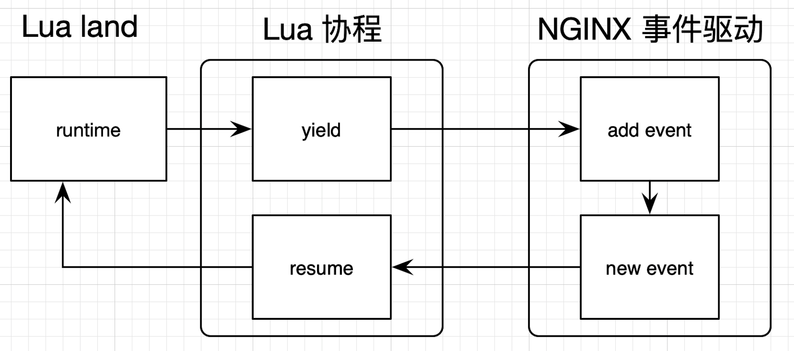
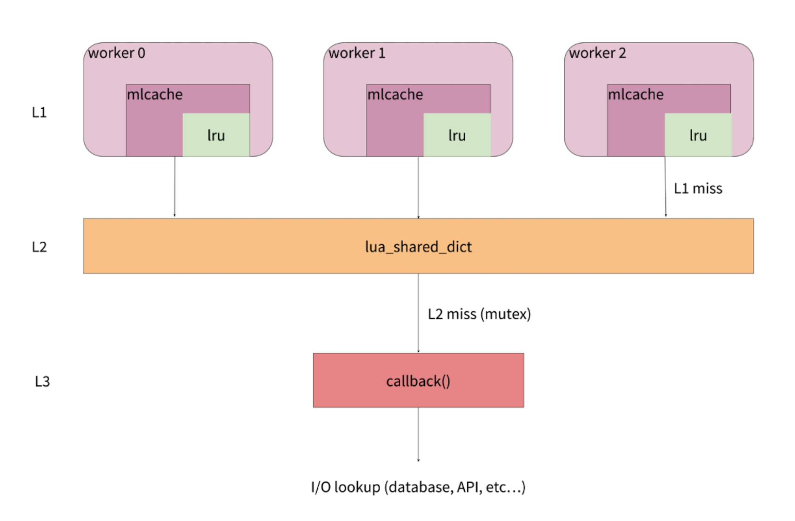

### LuaJIT

LuaJIT 语法兼容 Lua 5.1，并对 Lua 5.2 和 5.3 做了选择性支持。

OpenResty 维护了自己的 LuaJIT 分支，并扩展了很多独有的 API。

Lua 也内置了虚拟机，Lua 代码是先由 Lua 编译器编译为字节码（Byte Code），然后再由 Lua 虚拟机执行。而 LuaJIT 的运行时环境，除了一个会员实现的 Lua 解释器外，还有一个可以直接生成机器代码的 JIT 编译器。开始的时候，LuaJIT 和标准 Lua 一样，Lua 代码被编译为字节码，字节码被 LuaJIT 的解释器解释执行。但不同的是，LuaJIT 解释器会在执行字节码的同时，记录一些运行时的统计信息，比如每个 Lua 函数调用入口的实际运行次数，还有每个 Lua 循环的实际执行次数。当这些次数超过某个随机的阈值时，便认为对应的 Lua 函数入口或者对应的 Lua 循环足够热，这时便会触发 JIT 编译器开始工作。

LuaJIT 紧密结合了 FFI（Foreign Funtion Interface），可以让你直接在 Lua 代码中调用外部的 C 函数和使用 C 的数据结构。

### lua-resty-core

在核心的 lua-nginx-module 中，调用 C 函数的 API，都是使用 Lua C API 来完成的；

而在 lua-resty-core 中，则是把 lua-nginx-module 已有的部分 API，使用 FFI 的模式重新实现了一遍。

这得益于 LuaJIT 的 JIT 模式，它会在 FFI 调用时优化 Lua 领域和 C 领域间传参和返回的过程，因此采用 FFI 要比直接调用 Lua CFunction 要快。至于能快多少，则取决于调用时两个领域间数据交换频繁情况。

### Lua CFunction 与 LuaJIT FFI

用 C 编写的函数，无法把返回值传给 Lua 代码，而是需要通过栈，来传递 Lua 和 C 之间的调用参数和返回值。

而 FFI 则不同。FFI 的交互部分是用 Lua 实现的，这部分代码可以被 JIT 跟踪到，并进行优化；代码也会更加简洁易懂。

#### LuaJIT FFI

LuaJIT 只负责由自己分配的资源；而 ffi.C 是 C 库的命名空间，所以，使用 ffi.C 分配的空间不由 LuaJIT 负责，需要自己手动释放。

```lua
local p = ffi.gc(ffi.C.malloc(n), ffi.C.free)
 ...
 p = nil -- Last reference to p is gone.
 -- GC will eventually run finalizer: ffi.C.free(p)
```

这段代码中，ffi.C.malloc(n) 申请了一段内存，同时 ffi.gc 就给它注册了一个析构的回调函数 ffi.C.free。这样一来，p 这个 cdata 在被 LuaJIT GC的时候，就会自动调用 ffi.C.free 来释放 C 级别的内存。而 cdata 是由 LuaJIT 负责 GC 的，所以上述代码中的 p 会被 LuaJIT 自动释放。

在 Openresty 中申请大块内存的时候，推荐使用 ffi.C.malloc 而不是 ffi.new。

1. ffi.new 返回的是一个 cdata，这部分内存由 LuaJIT 管理；
2. LuaJIT GC 的管理内存是有上限的，Openresty 中的 LuaJIT 并未开启 GC64 选项，所以单个 worker 内存的上限只有 2G。一旦超过 LuaJIT 的内存管理上限，就会导致报错。

### nil问题

- Lua 的 nil
- ngx.null
- ffi.null
- cjson.null
- cdata:NULL

### Lua非阻塞模型



### test::nginx

test::nginx 糅合了 Perl、数据驱动以及 DSL（Domain Specific Language，领域专用语言，或领域小语言）。对于同一份测试案例集，通过对参数和环境变量的控制，可以实现乱序执行、多次重复、内存泄漏检测、压力测试等不同的效果。

`use Test::Nginx::Socket;` ，这是 Perl 里面引用库的方式，就像 Lua 里面 require 一样。这也在提醒我们，test::nginx 是一个 Perl 程序。

`run_tests()` 是 test::nginx 中的一个 Perl 函数，它是测试框架的入口函数。如果还想调用 test::nginx 中其他的 Perl 函数，都要放在 run_tests 之前才有效。

`__DATA__` 是一个标记，表示它下面的都是测试数据。Perl 函数都应该在这个标记之前完成。

`=== TEST 1: set Server`，是测试案例的标题，是为了注明这个测试的目的，它里面的数字编号有工具可以自动排列。

`--- config` 是 Nginx 配置段。在上面的案例中，我们用的都是 Nginx 的指令，没有涉及到 Lua。如果你要添加 Lua 代码，也是在这里用类似 content_by_lua 的指令完成的。

`--- request` 用于模拟终端发送一个请求，下面紧跟的 GET /foo，则指明了请求的方法和 URI。

`--- response_headers`，是用来检测响应头的。下面的 Server: Foo 表示在响应头中必须出现 header 和 value，如果没有出现，测试就会失败。

`--- response_body`，是用来检测响应体的。下面的 hi 则是响应体中必须出现的字符串，如果没有出现，测试就会失败；

`eval` 括起一段字符串（可包括不可见字符）、`.` 拼接字符串、`x` 表示重复次数 

```perl
--- request eval
"POST /t\n" . "a" x 1024
```

| #    | name                                     | description          |
| ---- | ---------------------------------------- | -------------------- |
| 1    | pipeline_requests                        | 发送多个请求         |
| 2    | repeat_each                              | 对同一个测试执行多次 |
| 3    | more_headers                             | 添加请求头           |
| 4    | response_body_like、response_body_unlike | 支持正则响应体匹配   |
| 5    | response_body                            | 处理响应体           |
| 6    | response_headers                         | 匹配响应头           |
| 7    | error_code                               | 匹配响应码           |
| 8    | error_log                                | 匹配错误日志         |
| 9    | eval                                     | 嵌入 perl 代码       |

#### 调试

| #    | name | description        |
| ---- | ---- | ------------------ |
| 1    | ONLY | 只运行该测试用例   |
| 2    | SKIP | 跳过该测试用例     |
| 3    | LAST | 忽略后面的测试用例 |
| 4    | plan | 比较复杂，建议关闭 |

`add_block_preprocessor` 指令来增加预处理 perl 代码

**鲜为人知的坑：**乱序，test::nginx 默认乱序、随机来执行测试案例，初衷是想测试出更多的问题。但每次都是随机的，可能报错，也可能不报错，每次的报错还可能不同，会给开发者带来困惑。建议关掉这个特性：`no_shuffle();`

### 性能优化

#### 理念

- 处理请求要短、平、快
- 避免产生中间数据

避免使用阻塞函数，尽量使用lua-resty库函数

使用 table.concat 代替字符串拼接

采用 table.new() 预先生成 table，并自己控制数组下标（可读性变差，容易出bug，避免过度优化）

#### 性能分析与问题定位

火焰图、SystemTap、Mozilla RR（录制程序行为）、二分查找和注释、OpenTracing、Dtrace（动态追踪）

Systemtap 没有默认进入内核、eBPF（extended BPF）有内核直接支持、不会死机、启动速度快

Intel 出品的 VTune

Perf 和 Systemtap 等工具产生的数据，都可以通过火焰图的方式展示

opentracing 分布式追踪技术

#### 火焰图

色块越宽，说明性能消耗越大。色块的长度代表的是函数调用的深度，最顶端的框显示正在运行的函数。

| #    | tool                           | 描述                          |
| ---- | ------------------------------ | ----------------------------- |
| 1    | systemtap-toolkit中的sample-bt | 生成 C 级别的 on CPU 火焰图   |
| 2    | stapxx 中的 lj-lua-stacks      | 生成 Lua 级别的 on CPU 火焰图 |

#### 缓存

| 缓存组件名  | 访问范围       | 缓存数据类型  | 数据结构   |
| ----------- | -------------- | ------------- | ---------- |
| shared dict | 多 worker 之间 | 字符串对象    | 字典、队列 |
| lru cache   | 单 worker 内   | 所有 Lua 对象 | 字典       |

| 缓存组件名  | 可以获取过期数据 | API数量 | 内存占用                |
| ----------- | ---------------- | ------- | ----------------------- |
| shared dict | 是               | 20多个  | 1份数据                 |
| lru cache   | 否               | 4个     | N 份数据（N=worker 数） |

共享内存只能存储字符串，复杂类型需要序列化与反序列化，回非常消耗 CPU 资源

`lua-resty-memcached-shdict、lua-resty-mlcache` 



L1 是 lua-resty-lrucache，每个worker 中都有自己独立的一份。

L2 是 shared dict。所有的worker共用一份缓存数据。

L3 是 L2 缓存没有命中的情况下，需要执行回调函数去外部数据库等数据源查询后，再缓存到 L2 中。在这里，为了避免缓存风暴，它会使用 lua-resty-lock，来保证只有一个worker去数据源获取数据。

### 参考资料

- https://segmentfault.com/a/1190000011093243
- https://blog.csdn.net/weixin_42910346/article/details/114026557