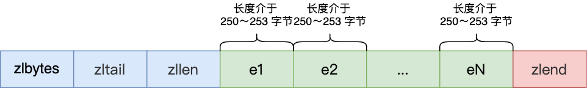
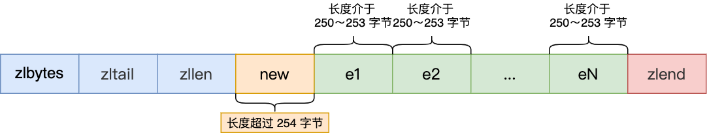

## Redis数据结构


​	左边是 Redis 3.0 版本，右边是最新的 Redis 代码的

​	可以看到，Redis 数据类型的底层数据结构随着版本的更新也有所不同，比如：

- 在 Redis 3.0 版本中 List 对象的底层数据结构由 双向链表 或 压缩列表 实现，但是在3.2版本之后，List 数据类型底层数据结构由 quicklist 实现的。
- 在最新的 Reids 代码中，压缩列表数据结构已经废弃了，交由 listpack 数据结构来实现了。

### 对象

​	Redis 的键值对中的 key 就是字符串对象，而 value 可以是字符串对象，也可以是集合数据类型的对象，比如 List 对象、Hash 对象、Set 对象和 Zset 对象。

​	举个例子，我这里列出几种 Redis 新增键值对的命令：

```shell
> SET name "cc"
OK
> hset persion name "cc"
(integer) 1
> rpush stu "cc" "dd"
(integer) 2
```

​	这些命令代表着：

- 第一条命令：name 是一个字符串键，因为键的值是一个字符串对象；
- 第二条命令：persion 是一个哈希表键，因为键的值是一个包含一个键值对的哈希表对象；
- 第三条命令：stu 是一个列表键，因为键的值是一个包含两个元素的列表对象；

​    这些键值对是如何保存在 Redis 中的呢？

​	Redis 是使用了一个 哈希表 保存所有键值对，哈希表的最大好处就是让我们可以用 O(1) 的事件复杂度来快速查找键值对。哈希表其实就是一个数组，数组中的元素叫做哈希桶。

​	Redis 的哈希桶是怎么保存键值对数据的呢？

​	哈希桶存放的是指向键值对数据的指针（dictEntry*），这样通过指针就能找到键值对数据，然后因为键值对的值可以保存字符串对象和集合数据类型的对象，所以键值对的数据结构中并不是直接保存值本身，而是保存了 void *key 和 void *value 指针，分别指向了实际的键对象和值对象，这样一来，即使值是集合数据，也可以通过 void *value 指针找到。

​	我这里画了一张 Redis 保存键值对所涉及到的数据结构，


​	对象结构里包含的成员变量：

- type，标识该对象是什么类型的对象（String 对象、List 对象、Hash 对象、Set 对象和 Zset 对象）；
- encoding，标识该对象使用了哪种底层的数据结构；
- ptr，指向底层数据结构的指针。

​    下图为 Redis 键值对数据库的全景图：


接下来，就好好聊一下底层数据结构！

### SDS

​	字符串在 Redis 中是很常见的，键值对中的键是字符串类型，值有时也是字符串类型。

​	Redis 是用 C 语言实现的，但是它没有直接使用 C 语言的 char* 字符串数组来实现字符串，而是自己封装了一个名为简单动态字符串（simple dynamic string，SDS）的数据结构来标识字符串，也就是 Redis 的 String 数据类型的底层数据结构是 SDS。

​	既然 Redis 设计了 SDS 结构来表示字符串，肯定是 C 语言的 char* 字符数组存在一些缺陷。

​	要了解这一点，得先来看看 char* 字符数组的结构。

#### C 语言字符串的缺陷

​	C 语言的字符串其实就是一个字符数组，即数组中每一个元素是字符串中的一个字符。

​	比如，下图就是字符串 ”xiaolin“ 的 char* 字符数组的结构：


​	没学过 C 语言的同学，可能会好奇为什么最后一个字符是 ”\0“？

​	在 C 语言里，对字符串操作时，char* 指针只是指向字符数组的起始位置，而字符数组的结尾位置就用”\0“表示，意思是指字符串的结束。

​	因此，C 语言标准库中的字符串操作函数就通过判断字符是不是"\0" 来决定要不要停止操作，如果当前字符不是 "\0"，说明字符串还没结束，可以继续操作，如果当前字符是 "\0“ 则说明字符串结束了，就要停止操作。

​	举个例子，C 语言获取字符串长度的函数 `strlen` ，就是通过字符数组中的每一个字符，并进行计数，等遇到字符为 ”\0“ 后，就会停止遍历，然后返回已经统计到的字符个数，即为字符串长度。下图显示了 strlen 函数的执行流程：


​	很明显，C 语言获取字符串长度的时间复杂度是 O(N) （这是一个可以改进的地方）

​	C 语言字符串用 "\0" 字符作为结尾标记有个缺陷。假设有个字符串有个 ”\0“ 字符，这时在操作这个字符串时就会提早结束，比如 ”xiao\0lin“ 字符串，计算字符串长度的时候则会是 4，如下图：


​	因此，除了字符串的末尾之外，字符串里面不能含有 ”\0“ 字符，否则最先被程序读入的 "\0" 字符将被误认为是字符串结尾，这个限制使得 C 语言的字符串只能保存文本数据，不能保存像图片、音频、视频文化这样的二进制数据（这也是一个可以改进的地方）

​	另外，C 语言标准库字符串的操作函数是很不安全的，对程序员很不友好，稍微一不注意，就会导致缓冲区溢出的。

​	举个例子，strcat 函数是可以将两个字符串拼接在一起。

```c
char *strcat(char *dest, const char *scr);
```

​	C 语言的字符串是不会记录自身的缓冲区大小的，所以 strcat 函数假定程序员在执行这个函数时，已经为 dest 分配了足够多的内存，可以容纳 src 字符串中的所有内容，而一旦这个假定不成立，就会发生缓冲区溢出将可能会造成程序运行终止。（这是一个可以改进的地方）。

​	而且，strcat 函数和 strlen 函数类似，时间复杂度也很高，也都需要先通过遍历字符串才能得到目标字符串的末尾。然后对于 strcat 函数来说，还要再遍历源字符串才能完成追加，对字符串的操作效率不高。

​	好了，通过以上的分析，我们可以得知 C 语言的字符串不足之处以及可以改进的地方。

- 获取字符串长度的复杂度为 O(N)；
- 字符串的结尾是以 ”\0“ 字符标识，字符串里面不能包含由 ”\0“ 字符，因此不能保存二进制数据；
- 字符串操作函数不搞笑且不安全，比如由缓冲区溢出的风险，有可能会造成程序运行终止；

​    Redis 实现的 SDS 的结构就把上面这些问题解决了，接下来我们一起看看 Redis 是如何解决的。

#### SDS 结构设计

下图就是 Redis 5.0 的 SDS 的数据结构：


​	结构中的每个成员变量分别介绍下：

- len：记录了字符串长度。这样获取字符串长度的时候，只需要返回这个成员变量值就行，时间复杂度只需要O(1)。
- alloc：分配给祖父数组的空间长度。这样在修改字符串的时候，可以通过 alloc - len 计算出剩余的空间大小，额可以用来判断空间是否满足修改需求，如果不满足的话，就会自动将 SDS 的空间扩展至执行修改所需的大小，然后才执行实际的修改操作，所以使用 SDS 既不需要手动修改 SDS 的空间大小，也不会出现前面所说的缓冲区溢出的问题。
- flags：用来表示不同类型的 SDS。一共设计了 5 种类型，分别是 sdshdr4、sdshdr8、sdshdr16、sdshdr32 和 sdshdr64，后面再说明区别之处。
- buf[]：字符数组，用来保存实际数据。不仅可以保存字符串，也可以保存二进制数据。

​    总的来说，Redis 的 SDS 结构再原本字符数组之上，增加了三个元数据：len、alloc、flags，用来解决 C 语言字符串的缺陷。

### 链表

​	Redis 的 List‘ 对象的底层实现之一就是链表。C 语言本身没有链表这个数据结构，所以 Redis 自己设计了一个链表数据结构。

#### 链表节点结构设计

​	先来看看 链表节点 结构的样子：

```c
typedef struct listNode {
	// 前置节点
	struct listNode *prev;
	// 后置节点
	struct listNode *next;
	// 节点的值
	void *value;
} listNode;
```

​	有前置节点和后置节点，可以看得出，这个是一个双向链表。

#### 链表结构设计

​	不过，Redis 在 listNode 结构体基础上又封装了 list 这个数据结构，这样操作起来会更方便，链表结构如下：

```c
type def struct list {
    // 链表头节点
    listNode *head;
    // 链表尾节点
    listNode *tail;
    // 节点值复制函数
    void *(*dup)(void *ptr);
    // 节点值释放函数
    void *(free)(void *ptr);
    // 节点值比较函数
    int (*match)(void *ptr, void *key);
    //链表节点数量
    unsigned long len;
} list;
```

​	list 结构为链表提供了链表头指针 head、链表尾节点 tail、链表节点数量 len、以及可以自定义实现的 dup、free、match 函数。

​	举个例子，下面是由 list 结构体和 3 个 listNode 结构组成的链表。


#### 链表的优势与缺陷

​	Redis 的链表实现优点如下：

- listNode 链表节点的结构里带有 prev 和 next 指针，获取某个节点的前置节点或后置节点的时间复杂度只需O(1)，而且这两个指针都可以指向 NULL，所以链表是无环链表；
- list 结构体因为提供了表头指针 head 和表尾节点 tail，所以获取链表的表头节点和表尾节点的时间复杂度只需O(1);
- list 结构因为提供了链表节点数量 len，所以获取链表中的节点数量的时间复杂度只需O(1);
- listNode 链表节点使用 void* 指针保存节点值，并且可以通过 list 结构的 dup、free、match 函数指针为节点设置该节点类型特定的函数，因此链表节点可以保存各种不同类型的值；

​    链表的缺陷也是有的：

- 链表每个节点之间的内存都不是连续的，意味着无法很好利用 CPU 缓存。能很好利用 CPU 缓存的数据结构就是数组，因为数组的内存是连续的，这样就可以充分利用 CPU 缓存来加速访问。
- 还有一点，保存一个链表节点的值都需要一个链表节点结构头的分配，内存开销较大。

###  压缩列表

​	压缩列表最大的特点，就是它被设计成一种内存紧凑型的数据结构，占用一块连续的内存空间，不仅可以利用 CPU 缓存，而且会针对不同长度的数据，进行相应编码，这种方法可以有效地节省内存开销。

​	但是，压缩列表的缺陷也是有的：

- 不能保存过多的元素，否则查询效率就会降低；
- 新增或修改某个元素时，压缩列表占用的内存空间需要重新分配，甚至可能引发连锁更新的问题。

​    因此，Redis 对象（List 对象、Hash对象、Zset对象）包含的元素数量较少，或者元素值不大的情况下才会使用压缩列表作为底层数据结构。

#### 压缩列表结构设计

​	压缩列表是 Redis 为了节约内存而开发的，它是由连续内存块组成的顺序型数据结构，优点类似于数组。


压缩列表在表头有三个字段：

- zlbytes：记录整个压缩列表占用对内存字节数；
- zltail：记录压缩列表 尾部 节点距离起始地址有多少字节，也就是列表尾的偏移量；
- zllen：记录压缩列表包含的节点数量；
- zlend：标记压缩列表的结束点，固定值 0xFF（十进制255）

在压缩列表中，如果我们要查找定位第一个元素和最后一个元素，可以通过表头三个字段的长度直接定位，复杂度是O(1)。而查找其他元素时，就没有这么高效了，只能逐个查找，此时的复杂度就是O(N)了，因此压缩列表不适合保存过多的元素。

​	另外，压缩列表节点（entry）的构成如下：


​	压缩列表节点包含三部分内容：

- prevlen：记录了 前一个节点 的长度；
- encoding：记录了当前节点实际数据的类型以及长度；
- data：记录了当前节点的实际数据；

​    当我们往压缩列表中插入数据时，压缩列表就会根据数据是字符串还是证书，以及数据的大小，会使用不同空间大小的 prevlen 和 encoding 这两个元素里保存的信息，这种根据数据大小和类型进行不同的空间大小分配的设计思想，正是 Redis 为了节省内存而采用的。

​	分别说下，prevlen 和 encoding 是如何根据数据的大小和类型来进行不同的空间大小分配。

​	压缩列表里的每个节点中的 prevlen 属性都记录了 前一个节点的长度，而且 prevlen 属性的空间大小跟前一个节点长度值有关，比如：

- 如果前一个节点的长度小于 254 字节，那么 prevlen 属性需要 1 字节的空间来保存这个长度值；
- 如果前一个节点的长度大于等于 254 字节，那么 prevlen属性需要用 5 字节的空间来保存这个长度值；

​    encoding 属性的空间大小跟数据是字符串还是整数，以及字符串的长度有关：

- 如果当前节点的数据是整数，则 encoding 会使用 1 字节的空间进行编码。
- 如果当前节点的数据是字符串，根据字符串的长度大小，encoding 会使用 1字节/2字节/5字节的空间进行编码。

#### 连锁更新

​	压缩列表新增某个元素或修改某个元素时，如果空间不够，压缩列表占用的内存空间就需要重新分配。而当新插入的元素较大时，可能会导致后续元素的 prevlen 占用空间都发生变化，从而因此 连锁更新 问题，导致每个元素的空间都需要重新分配，造成访问压缩列表性能的下降。

​	现在假设一个压缩列表中有多个连续的、长度在 250~253 之间的节点，如下图：



​	因为这些节点长度值小于 254 字节，所以 pevlen 属性需要用 1 字节的空间来保存这个长度值。

​	这时，如果将一个长度大于等于 254 字节的新节点加入到压缩列表的表头节点，即新节点将成为 e1 的前置节点，如下图：



​	因为 e1 节点的 prevlen 属性只有 1 字节大小，无法保存新节点的长度，此时就需要对压缩列表的空间重分配曹还，并将 e1 节点的 prevlen 属性从原来的 1 字节大小扩展为 5 字节大小。

​	多米诺牌的效应就此开始。


​	e1 原本的长度在 250~253 之间，因为刚才的扩展空间，此时 e1 的长度就大于等于 254 了，因此原本 e2 保存 e1 的 prevlen 属性也必须从 1 字节扩展至 5 字节大小。

​	正如扩展 e1 引发了对 e2 扩展一样，扩展 e2 也会引发对 e3 的扩展，.... 一直持续到结尾。

### 哈希表

​	Redis 采用了 链式哈希 来解决哈希冲突，在不扩容哈希表的前提下，将具有相同哈希值的数据穿起来，形成链接，以便这些数据在表中仍然可以被查询到。

#### 哈希表结构设计

```c
typedef struct dictht {
    // 哈希表数组
    dictEntry **table;
    // 哈希表大小
    unsigned long size;
    // 哈希表大小掩码，用于计算索引值
    unsinged long sizemask;
    // 该哈希表已有的节点数量
    unsigned long used;
} dictht;
```

- table：哈希表项的指针数组
- size：哈希表大小
- sizemask：掩码，假设 Redis 长度是 3，你想访问第 5 个元素，如果按之前的方法，那肯定是访问到超出 redis 哈希表范围的地址空间了。所以 Redis 规定，你想访问元素，先把 index 与 size 做与，把超过 redis 长度的部分截断了，就不会发生内存安全问题。
- used：哈希表已使用的大小


​	哈希表节点的结构如下：

```c
typedef struct dictEntry {
    // 键值对中的键
    void *key;
        
    // 键值对种的值
    union {
        void *val;
        uint64_t u64;
        int64_t s64;
        double d;
    } v;
    // 指向下一个哈希表节点，形成链表
    struct dictEntry *next;
} dictEntry;
```

​	dictEntry 结构里不仅包含指向键和值的指针，还包含了指向下一个哈希表节点的指针，这个指针可以将多个哈希值相同的键值对链接起来，以此来解决哈希冲突问题，这就是链式哈希。

#### rehash

​	Redis 定义一个 dict 结构体，这个结构体里定义了两个哈希表

​	之所以定义了 2 个哈希表，是因为进行 rehash 的时候，需要用上 2 个哈希表


​	rehash操作分为三步：

- 给 哈希表2 分配空间，一般比 哈希表1 大 2 倍；
- 将 哈希表1 的数据迁移到 哈希表2 中；
- 迁移完成后，哈希表1 的空间会被释放，并把 哈希表2 设置为 哈希表1，然后在 哈希表2 新创建一个空白的哈希表，为下次 rehash 做准备。

​    如果 哈希表1 的数据量非常大，那么在迁移至 哈希表2 的时候，因为会涉及大量的数据拷贝，此时可能会对 Redis 造成阻塞，无法服务其他请求。

#### 渐进式 rehash

​	渐进式 rehash 步骤如下：

- 给 哈希表2 分配空间；
- 在 rehash 进行期间，每次哈希表元素进行新增、删除、查找或者更新操作时，Rehash 除了会执行相应的操作之外，还会顺序将 哈希表1 中索引位置上的所有 key-value 迁移到 哈希表2 上；
- 随着处理客户端发起的哈希表操作请求数量越多，最终在某个时刻，会把 哈希表1 的所有 key-value 迁移到 哈希表2，从而完成 rehash 操作。

#### rehash 触发条件

​	rehash 的触发条件跟负载因子（load factor）有关系。

​	负载因子可以通过下面这个公式计算：`负载因子 = 哈希表已保存节点数量 / 哈希表大小`

​	触发 rehash 操作的条件，主要有两个：

- 当负载因子大于等于1，并且 Rehash 没有在执行 bgsave 命令或者 bgrewiteaof 命令，也就是没有执行 RDB 快照或者没有进行 AOF 重写的时候，就会进行 rehash 操作。
- 当负载因子大于等于5 时，此时说明哈希冲突非常严重了，不管有没有在执行 RDB 快照或 AOF 重写，都会强制进行 rehash 操作。

### 整数集合

​	整数集合本质上是一块连续内存空间，它的结构定义如下：

```c
typedef struct inset {
    // 编码方式
    uint32_t encodeing;
    // 集合包含的元素数量
    uint32_t length;
    // 保存元素的数组
    int8_t contents[];
} inset;
```

​	虽然 contents 被声明为 int8_t 类型的数组，但是实际上 contents 数组并不保存任何 int8_t 类型的元素，contents 数组的真正类型取决于 intset 结构体里的 encoding 属性的值。比如：

- 如果 encoding 属性值为 INTSET_INC_INT16，那么 contents 就是一个 int16_t 类型的数组，数组中每一个元素的类型都是 int16_t；
- 如果 encoding 属性值为 INTSET_INC_INT32，那么 contents 就是一个 int32_t 类型的数组，数组中每一个元素的类型都是 int32_t；
- 如果 encoding 属性值为 INTSET_INC_INT64，那么 contents 就是一个 int64_t 类型的数组，数组中每一个元素的类型都是 int64_t；

​    不同类型的 contents 数组，意味着数组的大小也会不同。

#### 升级操作

​	当我们将一个新元素加入到整数结合里面，如果新元素的类型（int32_t）比整数集合现有所有元素的类型（int16_t）都要长时，整数集合需要先进行升级，也就是按新元素的类型（int32_t）扩展 contents 数组空间大小，然后才能将新元素加入到整数集合里，当然升级的过程中，也要维持整数集合的有序性。

​	整数结合升级的过程中不会重新分配一个新类型的数组，而是在原本的数组上扩展空间，然后将每个元素按间隔类型大小分割，如果encoding 属性值为 INTSET_ENC_INT16，则每个元素的间隔就是 16 位。

​	举个例子，假设有一个整数集合里有 3 个类型为 int16_t 的元素。


​	现在，往这个整数集合中加入一个新元素 65535，这个新元素需要用 int32_t 类型来保存，所以整数集合要进行升级操作，首先需要为 contents 数组扩容，在原本空间大小之上再扩容多 80 位 `4×32-3×16=80`，这样就能保存下 4 个类型为 int32_t 的元素。


​	不支持奖及操作：一旦对数组进行了升级，就会一直保持升级后的状态。比如前面的升级操作的例子，如果删除了 65535 元素，整个集合的数组还是 int32_t 类型的，并不会因此降级为 int16_t 类型。

### 跳表


### quicklist

​	在 Redis 3.0 之前，List 对象的底层数据结构是双向链表或者压缩列表。然后在 Redis 3.2 的时候，List 对象的底层改由 quicklist 数据结构时间。

​	其实 quicklist 就是 双向链表+压缩列表 组合，因为一个 quicklist 就是一个链表，而链表中的每个元素又是一个压缩列表。

​	quicklist解决了压缩列表 连锁更新 的风险：通过控制每个链表节点中的压缩列表的大小或者元素个数，来规避连锁更新问题。因为压缩列表元素越少或越小，连锁更新带来的影响就越小，从而提供了更好的访问性能。

#### 结构设计

```c
typedef struct quicklist {
    // 链表头
    quicklistNode *head;
    // 链表尾
    quicklistNode *tail;
    // 所有压缩列表中的总元素个数
    unsigned long count;
    // quicklistNodes 的个数
    unsinged long len;
    ...
} quicklist;

typedef struct quicklistNode {
    // 前一个quicklistNode
    struct quicklistNode *prev;
    // 下一个quicklistNode
    struct quicklistNode *next;
    // quicklistNode指向的压缩列表
    unsigned char *zl;
    // 压缩列表的字节大小
    unsigned int sz;
    // 压缩列表的元素个数
    unsigned int count : 16;
    ...
} quicklistNode;
```

如图：


​	在向 quicklist 添加一个元素的时候，不会像普通的链表那样，直接新建一个链表节点。而是会检查插入位置的压缩列表能否容纳该元素，如果能容纳就直接保存到 quicklistNode 结构里的压缩列表，如果不能容纳，才会新建一个新的 quicklistNode 结构。

​	quicklist 会控制 quicklistNode 结构里的压缩列表的大小或者元素个数，来规避潜在的连锁更新的风险，但是这并没有完全解决连锁更新的问题。

### listpack

后续更新


### 参考资料

- https://www.cnblogs.com/xiaolincoding/p/15628854.html
- https://www.51cto.com/article/688890.html