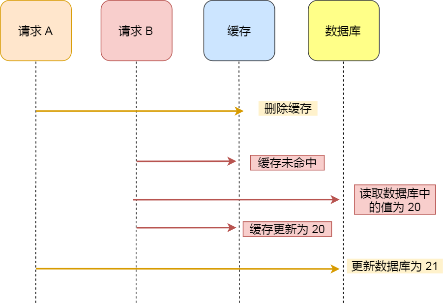

## 缓存一致性

### 定时全量刷新

1. 数据库的数据全量刷入缓存，不设置失效时间
2. 写请求只更新数据库，不更新缓存
3. 启动一个定时任务，定时把数据库中的数据更新到缓存中

#### 优点

- 所有的请求都可以命中缓存，不需要再查数据库，性能非常高

#### 缺点

- 缓存利用率低：不经常访问的数据还一直留在缓存中
- 数据不一致：因为是定时刷新缓存，缓存和数据库存在不一致

​    这种方案一般更适合业务体量小，且对数据一致性要求不高的业务场景。

### 实时更新

​	为解决缓存与数据库中数据不一致问题，更新数据时同时更新缓存与数据库中内容

​	为提高缓存利用率，为缓存设置过期时间，当请求读取的数据没有命中缓存时，数据库中读取数据同时将该数据写入缓存

#### 先更缓存后更数据库

​	假设 请求A 和 请求B 两个请求，同时更新 同一条 数据，则可能出现这样的顺序：

1. 请求A 更新缓存（X = 1）
2. 请求B 更新缓存（X = 2）
3. 请求B 更新数据库（X = 2）
4. 请求A 更新数据库（X = 1）

​    此时，数据库中的数据是 X = 1，而缓存中的数据却是 X = 2，出现了缓存和数据库中数据不一致的现象。

#### 先更数据库后更缓存

​	假设 请求A 和 请求B 两个请求，同时更新 同一条 数据，则可能出现这样的顺序：

1. 请求A 更新数据库（X = 1）
2. 请求B 更新数据库（X = 2）
3. 请求B 更新缓存（X = 2）
4. 请求A 更新缓存（X = 1）

​    此时，数据库中的数据是 X = 2，而缓存中的数据却是 X = 1，出现了缓存和数据库中数据不一致的现象。

​	所以，无论是 先更新数据库，再更新缓存，还是 先更新缓存，再更新数据库，这两个方案都存在并发问题，当两个请求并发更新同一条数据的时候，可能回出现缓存和数据库种不一致的现象。

​	除此之外，采用 更新数据库 + 更新缓存 的方案，在缓存利用率上也不太推荐。这是因为每次数据发生变更，都无脑更新缓存，但是缓存中的数据不一定会被马上读取，这就会导致缓存中可能存放了很多补偿访问的数据，浪费缓存资源。

​	而且很多情况下，写道缓存中的值，并不是与数据库中的值一一对应的，很有可能是先查询数据库，在经过一系列计算得出一个值，才把这个值写到缓存中。

​	由此可见，这种 更新数据库 + 更新缓存 的方案，不仅利用率不高，还会造成机器性能浪费。索引此时我们考虑另外一种方案：删除缓存。

#### 先删缓存后更数据库

​	为解决数据库与缓存不一致性问题，采用先删缓存后，再更新数据库，这样当请求读取缓存失败后，回从数据库中获取并更新缓存，来达到缓存与数据库的一致性。

​	但是仍然存在以下问题：

1. 请求A 删除缓存
2. 请求B 读取缓存失败，则读取数据库中的值（X = 20），并更新缓存中的数据为（X = 20）
3. 请求A 更新数据库（X = 21）

​    最终，缓存中的数据为（X = 20），数据库中的数据为（X = 21），缓存和数据库存在不一致。可以看到 先删缓存，再更新数据库，在 读 + 写 并发的时候，还是会出现缓存和数据库中的数据不一致的问题。

#### 先更数据库后删缓存

​	继续用 读 + 写 请求的并发场景来分析。

1. 请求A 读缓存未命中
2. 请求A 读取数据的值（X = 20）
3. 请求B 更新数据库中的数据（X = 21）
4. 请求B 删除缓存
5. 请求A 写缓存（X = 20）

​    最终，该用户在缓存中是（X = 20），在数据库中是（X = 21），缓存和数据库数据不一致。但是这种 【理论】来说的是可能发生的，但实际真的有可能发生吗？其实概率很低，因为它必须满足 3 个条件：

1. 缓存刚好已失效
2. 读请求 + 写请求并发
3. 更新数据库 + 删除缓存的时间（步骤3-4），要比都数据库 + 写缓存时间短（步骤2 和 5）

​    条件 3 发生的概率其实是非常低的。因为写数据库一般会先加锁，所以写数据库，通常是要比读数据库的时间更长的。

​	这么看来，先更新数据库后删除缓存的方案，是可以保证数据一致性的。

### 主从库延迟问题

​	在【先更新数据库后删缓存】方案下，【读写分离 + 主从库延迟】也会导致不一致：

1. 请求A 更新主库 X = 2（原值 X = 1）
2. 请求A 删除缓存
3. 请求B 查询缓存，没有命中，查询【从库】得到旧值（从库 X = 1）
4. 从库【同步】完成（主从库 X = 2）
5. 请求B 将【旧值】写入缓存（X = 1）

​    最终 X 的值在缓存中是1，在主从库是2，也发生了不一致。

#### 缓存延迟双删

​	解决第一个问题：在请求A 删除缓存、更新完数据库之后，先休眠一会，再删除一次缓存。

​	解决第二个问题：请求A 可以生成一条延时消息，写道消息队列中，消费者延时删除缓存。

延时时间设置多少合适：

- 问题1：延时时间要大于 主从复制 的延时时间
- 问题2：延时时间要大于线程B读取数据库 + 写入缓存的时间

### 原子性问题

​	前面我们分析了缓存与数据库更新的方式以及顺序问题，最终可以确定采用【先更新数据库后删缓存】的方法可以更有效的解决一致性问题，不过这些都是建立在更新数据库与删除缓存都可以成功的前提条件下。

​	如果第二步发生了失败，那么仍然会导致数据库和缓存的不一致性。

​	思考一下，程序在执行过程中发生异常，最简单的解决方法是什么？

​	答案是：重试。

重试可能会遇到的问题：

1. 第一次执行失败之后，立即重试很大概率还会失败
2. 重试次数 设置多少才合理？
3. 重试会一直占用这个线程资源，无法服务其它客户端请求

#### 异步重试

​	将重试请求写到【消息队列】中，然后由专门的消费者来重试，直到成功。

​	或者更直接的做法，为了避免第二步执行失败，我们可以把操作缓存这一步，直接放到消息队列中，由消费者来操作缓存。

#### 订阅数据库变更日志

​	订阅数据库变更日志就是，我们的业务应用在修改数据时，只需修改数据库，无需操作缓存。

​	那什么时候才做缓存呢？这就和数据库的变更日志有关了。

​	拿 MySQL 举例，当一条数据发生修改时，MySQL 就会产生一条变更日志（Binlog），我们可以订阅这个日志，拿到具体操作的数据，然后再根据这条数据，去删除对应缓存。并且还可以使用开源中间件来订阅变更日志（例如canal）

​	使用这种方案的优点在于：

- 无需考虑写消息队列失败情况：只要写 MySQL 成功，Binlog 肯定会有
- 自动投递到下游队列：开源中间件，例如canal 自动把数据库变更日志 投递 给下游的消息队列

### 总结

1. 想要提高应用的性能，可以引入 缓存 来解决
2. 引入缓存后，需要考虑缓存和数据库一致性问题，可选方案有：更新数据库 + 更新缓存、更新数据库 + 删除缓存
3. 更新数据库 +  更新缓存方案，再并发场景下无法保证缓存和数据一致性，且存在 缓存资源浪费 和机器性能浪费 的情况发生
4. 更新数据库 + 删除缓存的方案中，先删缓存后更数据库 在 并发 场景下依旧有数据不一致问题，解决方案是 延时双删，但这个延时时间很难评估，所以推荐采用 先更数据库后删缓存 的方案。
5. 先更数据库后删缓存 方案中，为了保证两部都成功执行，需配合 消息队列 或 订阅变更日志 的方案来做，本质是通过 重试 的方式保证数据一致性
6. 先更数据库后删缓存 方案中，读写分离 + 主从库延迟 也会导致缓存和数据库不一致，缓解此问题的的方案是 延时双删，凭借经验发送 演示消息 到队列中，延时删除缓存，同时也要控制主从库延迟，尽可能降低不一致发生的概率。

### 扩展

1. 性能和一致性不能同时满足，为了性能考虑，通常会采用 最终一致性 的方案
2. 掌握缓存和数据库一致性问题，核心问题有 3 点：缓存利用率、并发、缓存+数据库一起成功问题
3. 失败场景下要保证一致性，常见手段就是重试，同步重试会影响吞吐量，所以通常会采用异步重试的方案
4. 订阅变更日志的思想，本质是把权威数据源（例如MySQL）当作 leader 副本，让其它异质系统（例如Redis/Elasticasearch）成为它的follower副本，通过同步变更日志的方式，保证 leader 和 follower 之间保持一致。
5. 想要做到强一致性，最常见的方案是 2PC、3PC、Paxos、Raft 这类一致性协议，但它们的性能往往比较差，而且这些方案也比较复杂，还要考虑各种容错问题。

### 参考资料

- https://www.51cto.com/article/681251.html
- https://www.51cto.com/article/705563.html

