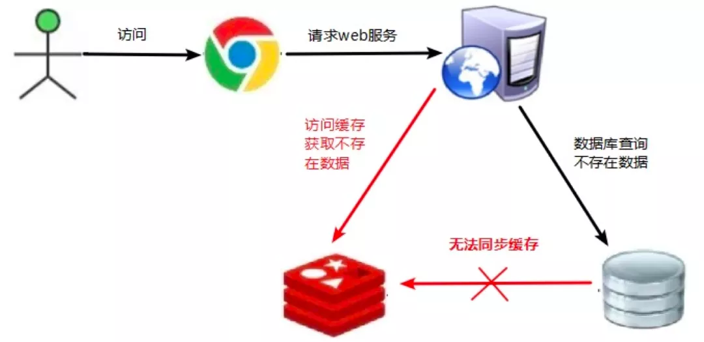
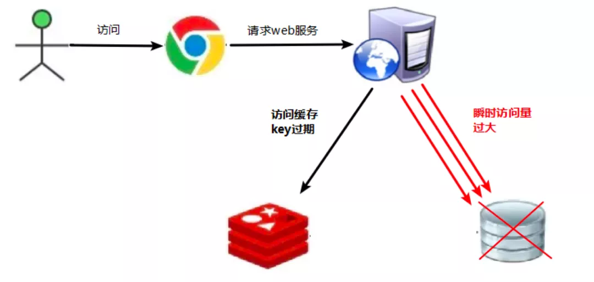
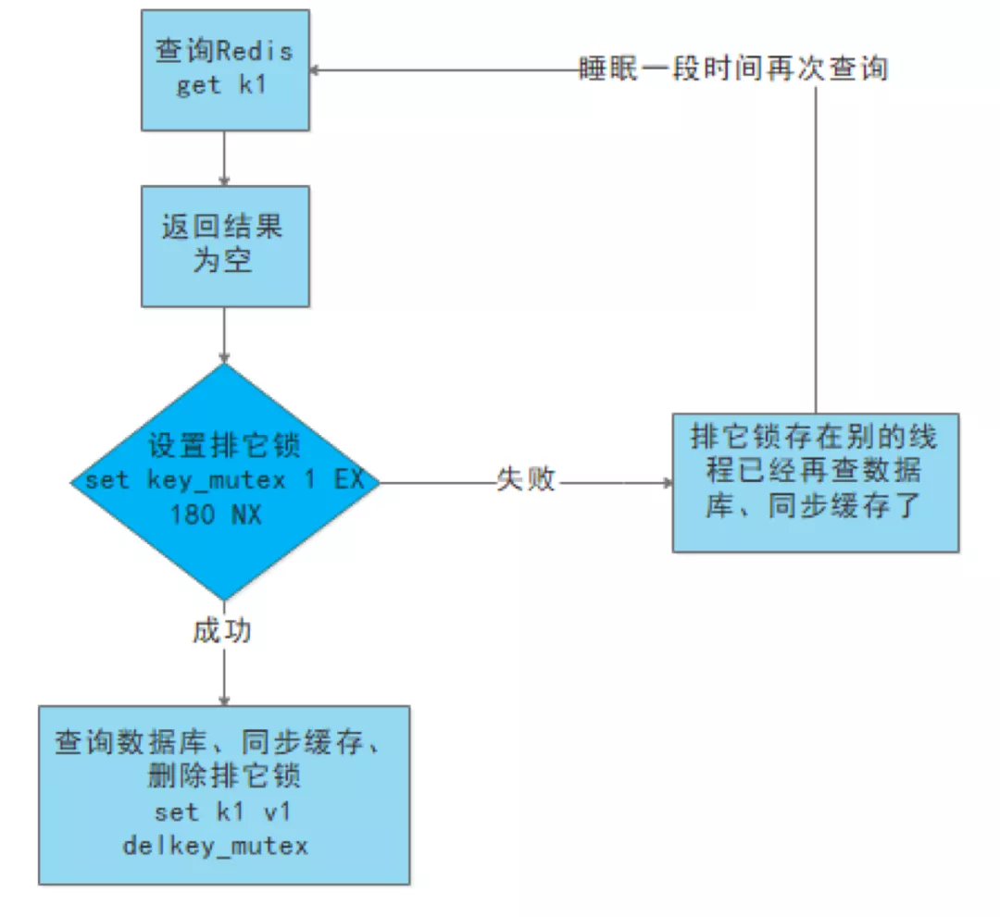

## 缓存问题

### 缓存穿透

​	缓存无数据，数据库也无数据

​	指的是对某个一定不存在的数据进行请求，该请求将会穿透缓存到达数据库。

​	如黑客恶意攻击，使用缓存和数据库均没有的 key 进行不断请求，导致数据库压力过大。

解决方法：

1. 对用户进行鉴权、对请求参数进行校验，不合理直接过滤。
2. 对查询不到的数据也放到缓存，value 为空，设置一定的过期时间。(不太常用如果是随机key就不起作用，且占缓存)
3. 使用布隆过滤器，快速判断 key 是否在数据库中存在，不存在直接返回。(最有效)

第 1 种是最常用的策略，第 2 种不太常用，因为如果是随机 key 就不起作用，且占缓存，第 3 种最简单有效。实际使用中，可以 1、3 相结合。

### 缓存击穿

​	缓存无数据，数据库有数据，key比较集中

​	如高并发的情况下，热点数据缓存过期，这时候会导致大量请求读不到缓存同时读数据库，导致数据库负载过大。

解决方法：

1. 设置热点数据永不过期。
2. 热点数据快过期时，异步的方式重新设置 key。
3. 当缓存数据过期，重新从数据库加载数据到缓存的过程上互斥锁。

第 1 种数据量大时，缓存量会比较大，第 2 种很好理解，但是需要另外的逻辑去维护，会增加系统的复杂度。第 3 种事比较常见的方式。

使用互斥锁就是在缓存失效的时候，不是立即去 load  db。先使用缓存工具的某些带成功操作返回值的操作（比如 Redis 的 SETNX）去 set 一个 mutex key， 当操作返回成功时，再进行 load db 的操作，并回设缓存，最后删除 mutex key。当操作返回失败，证明有线程在 load db，当前线程睡眠一段时间再重试整个 get 缓存的方法。

### 缓存雪崩

​	缓存无数据，数据库有数据，key比较分散

​	指的是由于数据没有加载到缓存中，或者缓存数据在同一时间大面积失效（过期），又或者缓存服务器宕机，导致大量请求都到达数据库。

​	在有缓存的系统中，系统非常依赖于缓存，缓存分担了很大一部分的数据请求。当发生缓存雪崩时，数据库无法处理这么大的请求，导致数据库崩溃。

解决方案：

1. 缓存的失效时间设置为随机数，避免同时失效。
2. 构建多级缓存架构：nginx 缓存 + redis 缓存 + 其他缓存
3. 使用分布式缓存，分布式缓存中每一个节点只缓存部分的数据，当某个节点宕机时可以保证其它节点的缓存仍然可用。
4. 服务限流、降级，避免数据库被瞬间压崩。
5. 进行缓存预热，避免在系统刚启动不久由于还未将大量数据进行缓存而导致缓存雪崩。

### 缓存一致性

​	缓存一致性要求数据更新的同时缓存数据也能够实时更新。

解决方案：

1. 在数据更新的同时立即去更新缓存。
2. 在读缓存之前先判断缓存是否是最新的，如果不是最新的先进行更新。

​    要保证缓存一致性需要付出很大的代价，缓存数据最好是那些对一致性要求不高的数据，允许缓存数据存在一些脏数据。

### 参考资料

- https://www.cnblogs.com/pcheng/p/14780800.html
- https://cloud.tencent.com/developer/article/1824584