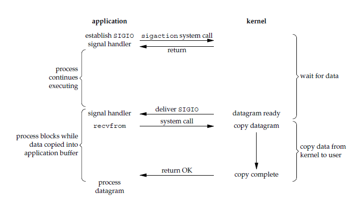

---

---

## I/O模型

一个输入操作通常包括两个阶段：

- 等待数据准备好
- 从内核向进程复制数据

对于一个套接字上的输入操作，第一步通常涉及等待数据从网络中到达。当锁等待数据到达时，它被复制到内核的某个缓冲区。第二步就是把数据从内核缓冲区复制到应用进程缓冲区。

Unix 有五种 I/O 模型：

- 阻塞式 I/O
- 非阻塞式 I/O
- I/O复用 (select、poll 和 epoll)
- 信号驱动式 I/O (SIGIO)
- 异步 I/O (AIO)

### 阻塞式 I/O

应用进程被阻塞，直到数据从内核缓冲区复制到应用进程缓冲区中才返回。

应该注意到，在阻塞的过程中，其它应用进程还可以执行，因此阻塞不意味着整个操作系统都被阻塞。因为其他应用进程还可以执行，所以不消耗CPU时间，这种模型的CPU利用率会比较高。

下图中，recvfrom() 用于接收 Socket 传来的数据，并复制到应用进程的缓冲区 buf 中。这里把 recvfrom() 当成系统调用。

```c
ssize recvfrom(int sockfd, void *buf, size_t len, int flags, struct sockaddr *src_addr, socklen_t *addrlen);
```


### 非阻塞式 I/O

应用程序执行系统调用后，内核返回一个错误码。应用程序可以继续执行，但是需要应用程序不断地执行系统调用来获知 I/O 是否完成，这种方式成为轮询 (polling)。

由于 CPU 需要处理更多地系统调用，因此这种模型的 CPU 利用率也比较低。


### I/O 复用

使用 select 或者 poll 等待数据，并且可以等待多个套接字中任何一个变为可读。这一过程会被阻塞，当某一个套接字可读时返回，之后再使用 recvfrom 把数据从内核复制到进程中。

它可以让单个进程具有处理多个 I/O 事件的能力。又被称为 Event Driven I/O，即事件驱动 I/O。

如果一个 Web 服务器没有 I/O 复用，那么每一个 Socket 链接都需要创建一个线程去处理。如果同时有几万个连接，那么就需要创建想统数量的线程。相比于多进程和多线程技术，I/O 复用不需要进程线程创建和切换的开销，系统开销更小。


### 信号驱动 I/O

应用进程使用 sigaction 系统调用，内核立即返回，应用进程可以继续执行，也就是说等待数据阶段应用进程是非阻塞的。内核在数据到达时向应用进程发送 SIGIO 信号，应用进程收到之后在信号处理程序中调用 recvfrom 将数据从内核复制到应用进程中。



### 异步 I/O

应用进程执行 aio_read 系统调用会立即返回，应用进程可以继续执行，不会被阻塞，内核会在所有操作完成之后向应用进程发送信号。

异步 I/O 与信号驱动 I/O 的区别在于，异步 I/O 的信号是通知应用进程 I/O 完成，而信号驱动 I/O 的信号是通知应用进程可以开始 I/O


### 五大 I/O 模型比较

- 同步 I/O：将数据从内核缓冲区复制到应用进程缓冲区的阶段，应用进程会阻塞。
- 异步 I/O：不会阻塞

阻塞式 I/O、非阻塞式 I/O、I/O 复用和信号驱动 I/O都是同步 I/O，它们的主要区别在于第一阶段。非阻塞式 I/O、信号驱动 I/O 和异步 I/O 在第一阶段不会阻塞。

