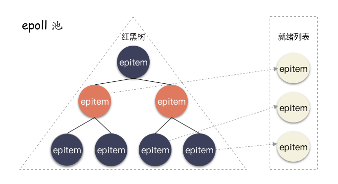
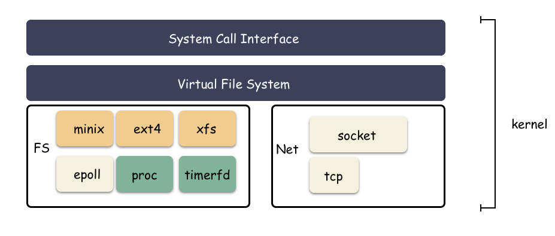

# I/O模型

## epoll

### epoll高效的原理

首先，epoll的第一步是是创建一个池子。使用epll_create来做：

```c
int epoll_create(int size);
```

示例：

```c
epollfd = epoll_create(1024);
if (epollfd == -1) {
    perror("epoll_create");
    exit(EXIT_FAILURE);
}
```

这个池子是由操作系统来维护，对用户层来说是个黑盒，这个黑盒是用来装fd的。我们拿到了一个epollfd，这个epollfd就能唯一代表这个epoll池。【用户可以创建多个epoll池】。

然后，我们就要往这个epoll池里放fd了，使用epoll_ctl来做：

```c
int epoll_ctl(int epfd, int op, int fd, struct epoll_event *event);
```

示例：

```c
if (epoll_ctl(epollfd, EPOLL_CTL_ADD, 11, &ev) == -1) {
    perror("epoll_ctl: listen_sock");
    exit(EXIT_FAILURE);
}
```

上面，我们就把句柄11放到这个池子里了，op(EPOLL_CTL_ADD)表明操作是增加、修改、删除，event结构体可以指定监听事件类型，可读可写。

【高效原因一】为了快速的对fd池子里的fd快读的增删改查呢？

红黑树。红黑树的性质更适合此处的场景，时间复杂度为O(logn)。

【高效原因二】怎么才能保证数据准备好之后，立马感知呢？

poll回调。在epoll_ctl的内部实现中，除了把句柄结构用红黑树管理，另一个核心步骤就是设置poll回调。

### poll回调

先说说file_operation->poll是什么？

Linux设计成一切皆文件的架构，不是说说而已，而是随处可见的。实现一个文件系统的时候，就要实现这个文件调用，这个结构体用 struct file_operation 来表示。这个结构体有非常多的函数，精简了一些，如下：

```c
struct file_operations {
    ssize_t (*read) (struct file *, char __user *, size_t, loff_t *);
    ssize_t (*write) (struct file *, const char __user *, size_t, loff_t *);
    __poll_t (*poll) (struct file *, struct poll_table_struct *);
    int (*open) (struct inode *, struct file *);
    int (*fsync) (struct file *, loff_t, loff_t, int datasync);
    // ....
};
```

read，write，open，fsync，poll等等，这些都是对文件的定制处理操作，对于文件的操作其实都是在这个框架内实现逻辑而已，比如ext2如果有对read/write做定制化，那么就会是ext2_read,ext2_write，ext4就会是ext4_read, ext4_write。在open具体文件的时候会赋值对应文件系统的file_operations给到file结构体。

我们很容易知道read是文件系统定制fd读的行为调用，write是文件系统定制fd写的行为调用，file_operations->poll呢？

这个是定制监听时间的机制实现。通过poll机制让上层能直接告诉底层，我这个fd一旦读写就绪了，请底层硬件(比如网卡)回调的时候自动把这个fd相关的结构体放到指定队列中，并且唤醒操作系统。

举个例子：

网卡收发包其实走的异步流程，操作系统把数据丢到一个指定地点，网卡不断地从这个指定地点拿数据处理。请求响应通过中断回调来处理，中断一般拆分成两部分：硬中断与软中断。poll函数就是把这个软中断回来地路上再加点料，只要读写事件触发地时候，就会立马通知到上层，采用这种事件通知地形式就能防止有浪费的时间窗。

这个poll事件回调机制是epoll池高效最核心的原理。epoll池管理句柄只能是支持了file_operations->poll的文件fd。换句话说，如果一个文件所在的文件系统没有实现poll接口，那么就用不了epoll机制。

### 设置poll

在epoll_ctl的实现中，有一步是调用vfs_poll，这里面就会有个判断，如果fd所在的文件系统的file_operations实现了poll，那么就直接调用，如果没有，那么就会报告响应的错误码。

```c
static inline __poll_t vfs_poll(struct file *file, struct poll_table_struct *pt)
{
    if (unlikely(!file->f_op->poll))
        return DEFAULT_POLLMASK;
    return file->f_op->poll(file, pt);
}
```

### poll调用

poll里面究竟是实现了什么？总结概括来说：挂了个钩子，设置了唤醒的回调路径。epoll跟底层对接的回调函数是：ep_poll_callback，这个函数其实很简单，做了两件事：

1. 把事件就绪的fd对应的结构体放到一个特定的队列(就绪队列，ready_list);
2. 唤醒epoll，告诉epoll有工作了；

当fd满足可读或可写的时候就会经过层层回调，最终调用到这个回调函数，把对应fd的结构体放到就绪队列中，从而把epoll从epoll_wait处唤醒。

【这个对应的结构体是什么？】

这个对应结构体叫作epitem，每个注册到epoll池的fd都会对应一个。

【就绪队列需要很高级的数据结构吗？】

就绪队列很简单，因为没有查找的需求了，只要是在就绪队列中的epitem，就是事件就绪的，必须处理的。所以就绪队列就是一个简单的双指针链表。

### 小结

epoll高效的原因：

1. 内部管理fd使用了高效的红黑树结构管理，做到了增删改之后性能的优化和平衡；
2. epoll池添加fd的时候，调用file_operations->poll，把这个fd就绪之后的回调路径安排好。通过事件通知的形式，做到最高效的运行；
3. epoll池核心的两个数据结构：红黑树和就绪列表。红黑树是为了应对用户的增删改需求，就绪队列是fd事件就绪之后放置的特殊地点，epoll池只需要遍历这个就绪链表，就能给用户返回所有已经就绪的fd数组；



## 扩展

【哪些fd可以用epoll来管理？】

由于并不是所有的fd对应的文件系统都实现了poll接口，所以自然并不是所有的fd都可以放进epoll池，那么哪些文件系统的file_operations实现了poll接口？

首先，类似ext2，ext4，xfs这种常见的文件系统是没有实现的，换句话说这些最常见的、真正的文件的文件系统反倒是用不了epoll机制。

那么谁支持呢？

最常见的是网络套接字：socket。网络也是epoll池最常见的应用地点。Linux下万物皆文件，socket实现了一套socket_file_operations的逻辑 (net/socket.c):

```c
static const struct file_operations socket_file_ops = {
    .read_iter =    sock_read_iter,
    .write_iter =   sock_write_iter,
    .poll =     sock_poll,
    // ...
};
```

我们看到socket实现了poll调用，所以socket fd是天然可以放到epoll池管理的。

还有支持的吗？

有的，很多。Linux下还有两个很典型的fd，常常也会放到epoll池里。

1. eventfd： eventfd实现非常简单，顾名思义就是专门用来做事件通知用的。使用系统调用eventfd创建，这种文件fd无法传输数据，只用来传输事件，常常用于生产消费者模式的事件实现；
2. timerfd： 这是一种定时器fd，使用timerfd_create创建，到时间点触发可读事件；

其实，在Linux的模块划分中，eventfd，timerfd，epoll池都是文件系统的一种模块实现。



## 思考

【问】单核CPU能实现并行吗？

不行

【问】：单线程能实现高并发吗？

可以

【问】：并发和并行的区别是？

一个看的是时间段内执行的情况，一个看的是时间时刻的执行情况。

【问】：单线程如何做到高并发？

IO多路复用，epoll线程池就是了。

【问】：单线程实现并发的开源例子有哪些？

redis，nginx，golang的runtime实现也尽显高并发的设计思想。

## 总结

1. IO多路复用的原始实现很简单，就是1对多的服务模式，一个loop对应处理多个fd；
2. IO多路复用想要做到真正的高效，必须要内核机制提供。因为IO的处理和完成时在内核，如果内核不帮忙，用户态的程序根本无法精确抓到处理时机；
3. fd记得要设置成非阻塞的
4. epoll池通过高效的内部管理结构，并且结合操作系统提供的poll事件注册机制，实现了高效的fd事件管理，为高并发的IO处理提供了前提条件；
5. epoll全名eventpoll，在Linux内核下以一个文件系统模块的形式实现，所以有人常说epoll其实本身就是文件系统；
6. socketfd，eventfd，timerfd这三种文件fd实现了poll接口，所以网络fd，事件fd，定时器fd都可以使用epoll_ctl注册到池子里。我们最常见的就是网络fd的多路复用；
7. ext2，ext4，xfs这种真正意义的文件系统反倒没有提供poll接口实现，所以不能用epoll池来管理其句柄。那文件就无法使用epoll机制了吗？并不是，有一个库叫作libaio，通过这个库我们可以间接的让文件使用epoll通知事件。

参考链接

- https://www.teqng.com/2021/07/24/linux-%E7%AF%87%EF%BC%9A-epoll-%E5%AE%9E%E7%8E%B0%E7%9A%84%E5%A4%9A%E8%B7%AF%E5%A4%8D%E7%94%A8%E4%B8%BA%E4%BB%80%E4%B9%88%E8%BF%99%E4%B9%88%E5%BF%AB%EF%BC%9F/